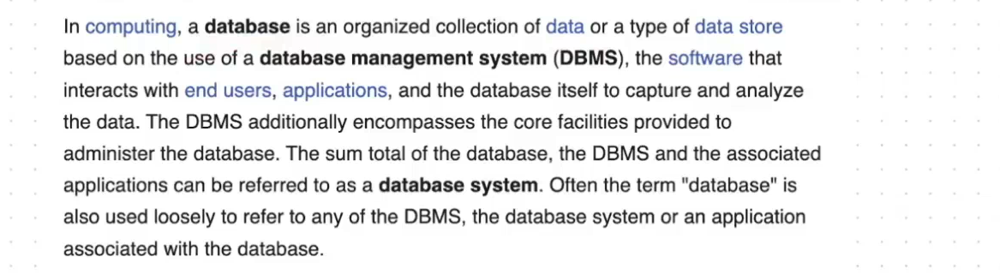
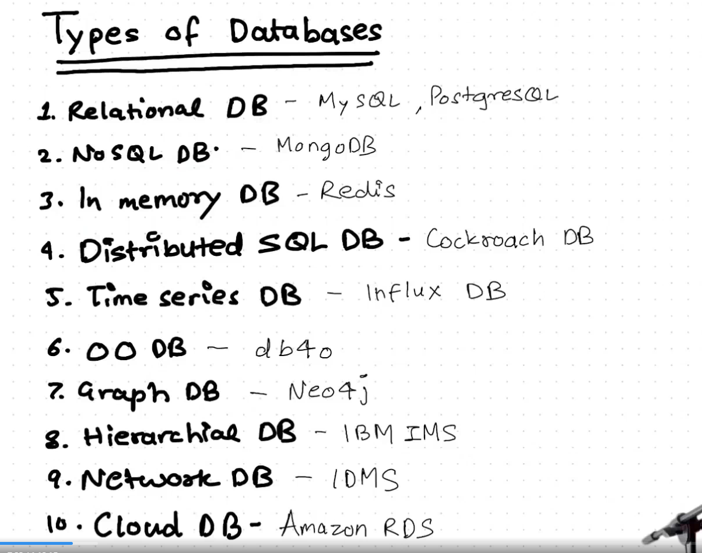
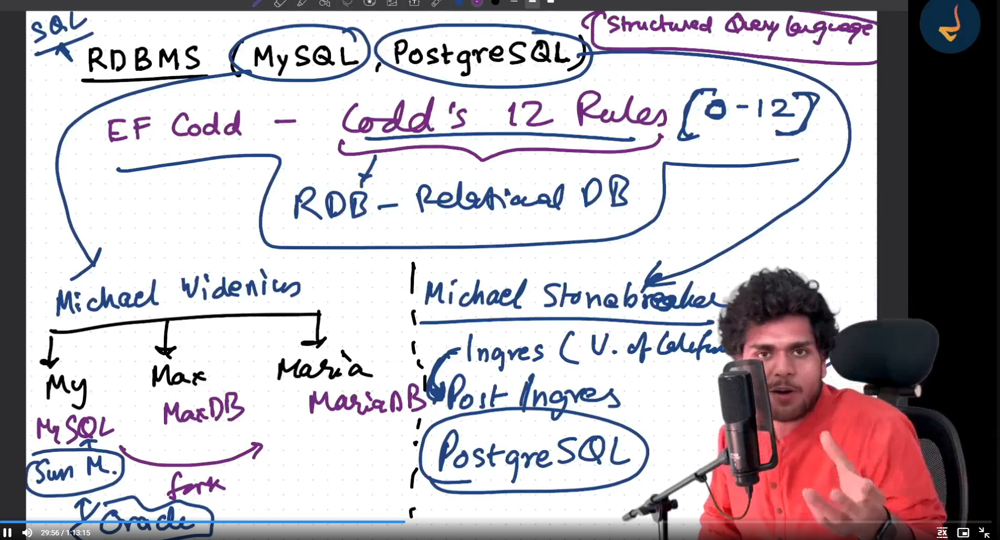
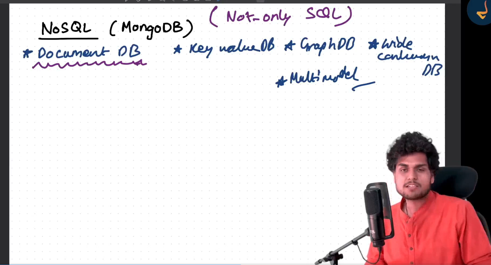
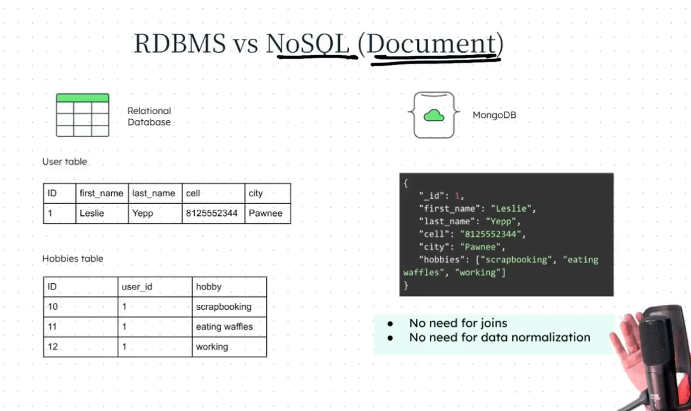
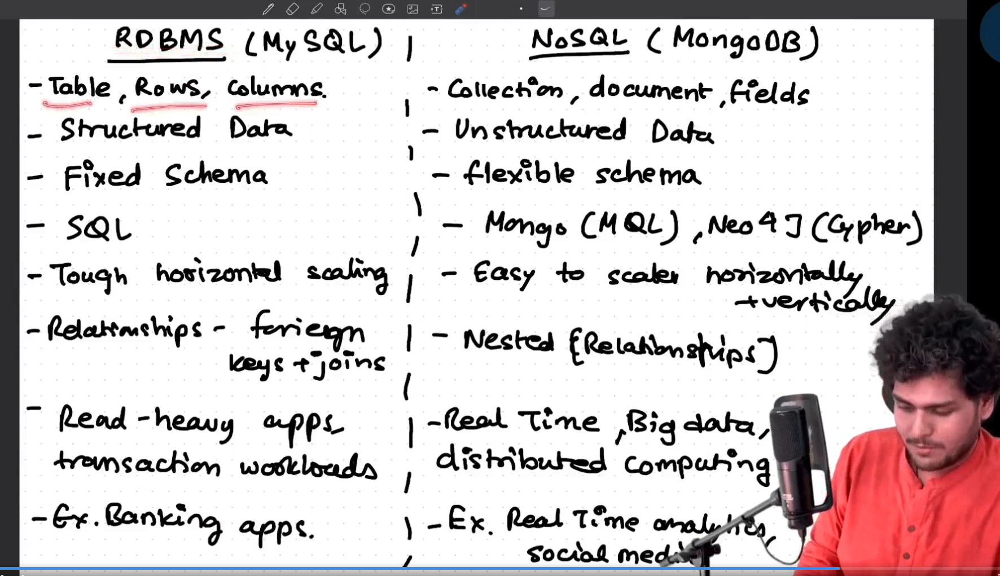

 

In big tech companies, they use different type of database. they are not restricted to one database.

Redis is a database which is used for catching. If there are some api which is frequently used, so we keep that data in redis.
You have herd of concept RAM and ROM, where RAM is known as faster memory, but it cannot store the large amount of data.
and ROM is the actual memory or storage in your computer.
so similary we have redis and actual database. Redis is faster than actual database. But it cannot store the large amount of data. redis use the RAM.

whenever we make a api call, it will first check if the data is in redis or not. if it is in redis then it will return the data from redis. if it is not in redis then it will check it in the actual database, and fetch the data from there and return it to the client, and along with this it will also store the data in redis, so that next time when we make a api call, it will return the data from redis.

Amazon RDS is not a database, it is a service that provides managed relational databases. 

What is the uses of different database?

Each database has pros and cons. Some database are read heavy database, some database are write heavy database.It depends on usecase.

Relational Database
it started in 1980
EF codd - Codd's 12 Rules(0-12)
 actual the rules are 0-12, so there are 13 rules
 if your database follows this rules then it will become the relational database.
 MYSQL and PostgresSQL are most famous relational database.
 MySql database is managed by oracle.

SQL - Structured Query Language
- it is a language which is used to communicate with the database.

Non Relational Database
 it is also known as NoSQL database.
 if the data is not structured then we use NoSQL database.

NosQL Database

There are 4 types of NoSQL Database

1. Document Database  - MongoDB
2. Key Value Database - Redis
3. Wide Column Database - Cassandra
4. Graph Database - Neo4j
5. Multi-Model Database - Couchbase

  

IT is very flexible
very compact wih nodejs
it stored the data in document mapped with json

In RDBMS it works based on rows and columns

IN Nosql data base we don't have tables
we have collections  -  table
collection contains documents - rows
documents contains key value pairs - columns

it stores the data in form of document.

you don't need Joins
you don't need data normallllization

MongoDB is popular, because this looks similar to JSON, which is used in NodeJS, JavaScript. 

diffference between the RDBMS(MYSQL) and NOSQL(MONGO)

when you design a system then according the product, requirement we choose the database.
mongodb is a cross platform, it can be used on any platform.

there are 2 ways to use the mongoDb
1. install mongodb and use it.
2. use the cloud based mongoDb service, like mongodb atlas.

mongoDB has 2 version of Database. it doesn't mean it has 2 product. it has only 1 product but it has 2 version
1. Community Version - This is free to use. Community is collection of developers.
2. Enterprise Version - This is paid version. It has more features than Community Version.

if you don't use the mongoDB atlas then you need to deploy the database as well.
but there is few probleums

as in this case you itself need to take care of it.
1. scaling
2. backup
3. security
4. os updates
5. memory management
6. always Up

In enterprise version of mongodb, the headache of baackup data, making replica all the stuff is taken care by mongodb, they bsically create a new server for you and deploy that cluster on that server and manage that for you.

so mongodb will create the cluster and deploy that cluster on the machine.

our database is managed on AWS server by mongoDB, but how can I access the data or see the data in the database, we can see it using mongoDB compass.
MongoDB compass is the UI tool for accessing the mongodb database.

you need to install the mongoDB package.
NPM is a package/library which contain lot of modules used by developers in node.

Don't memorize any code.
This library is very new for you.
So you have to read the documentation for understanding. If you are using some thing new you should read the documentation or api reference to understand.

whenever you are using a new library, a good developer always go to the documentation and see how to use the tool.

