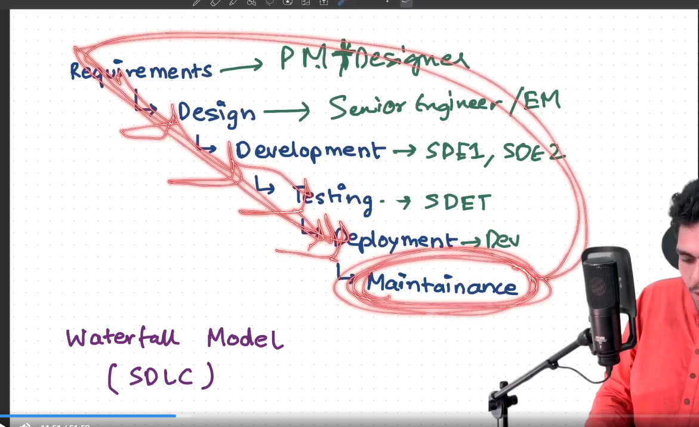
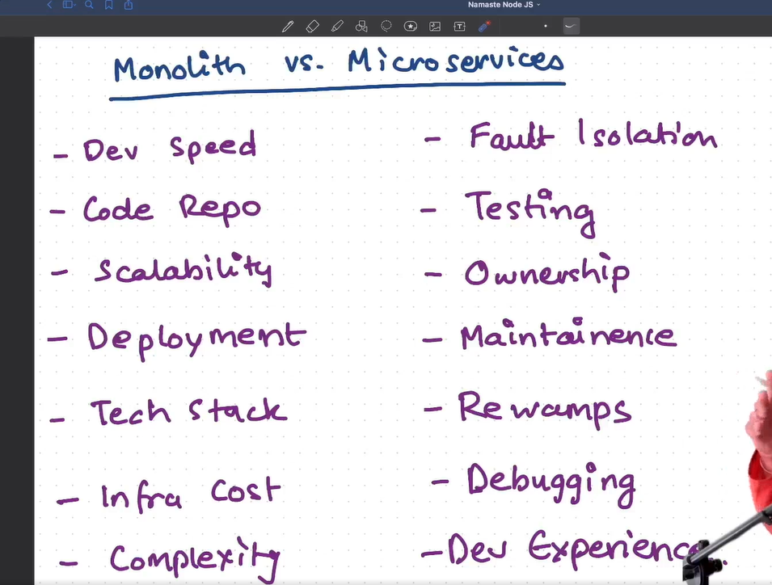
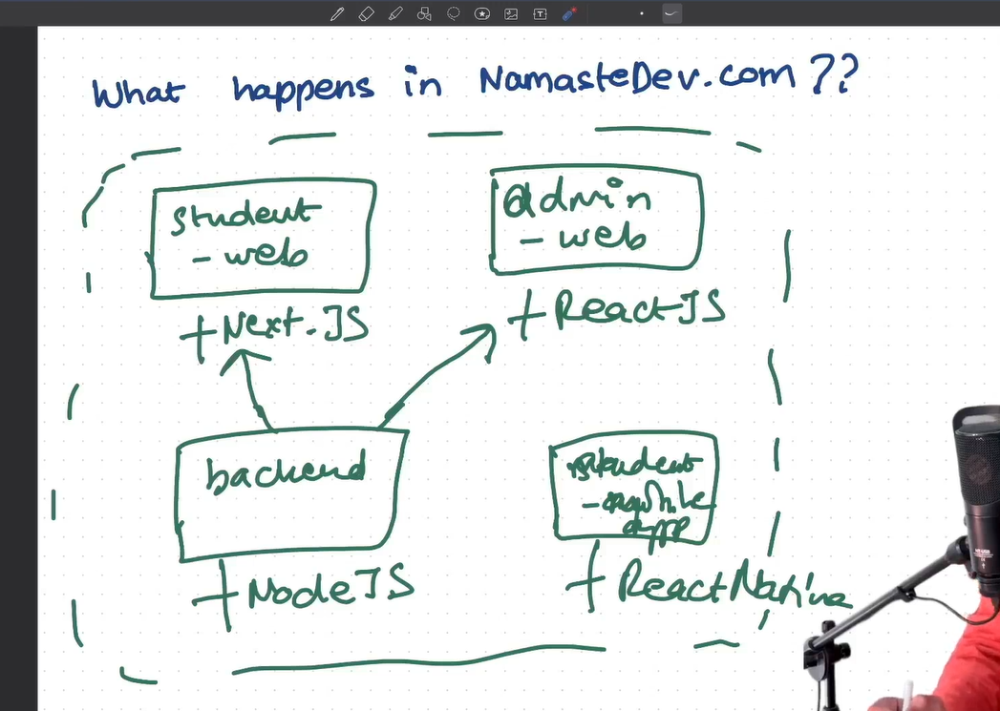
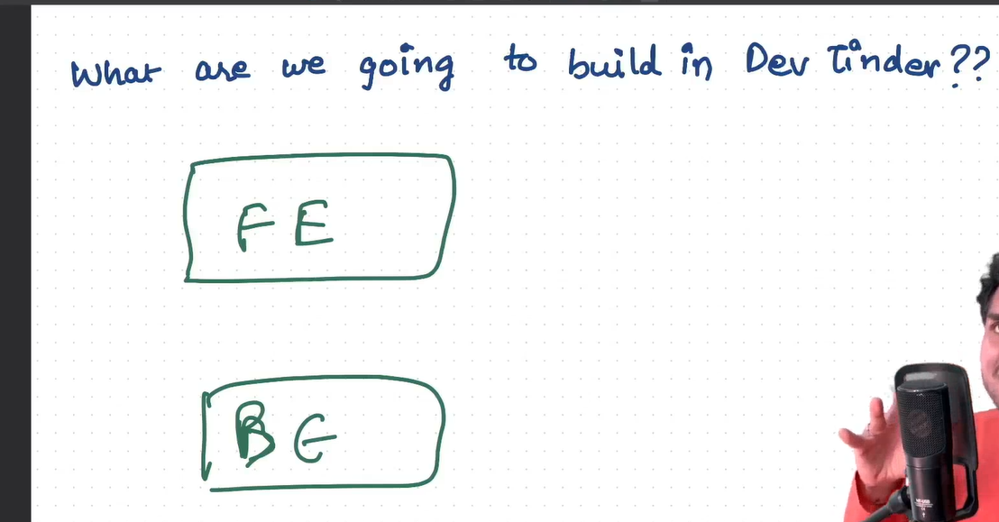
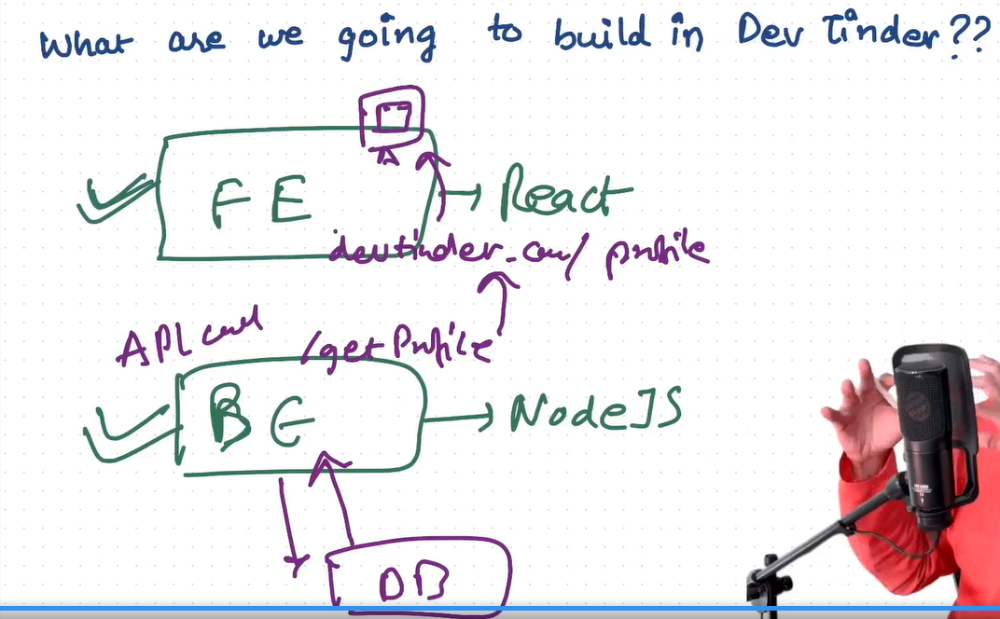

SDLC (Software Development life cycle)

Waterfall model

1. Requirements gathering and analysis
2. Design
3. Implementation or development
4. Testing
5. Deployment
6. Maintenance

1. Requirements Gathering and Analysis: This Job is done by project manager + Designer 
so project manager will sit and think about the application from the client's perspective and will jot down the requirements. Designer will design the application from the user's perspective.
- what is the application about
- what feature will be built in it.
- how we are going to built it.
- different sceanrio and techstack.
- Target audience

2. Design: This job is done by Senior Engineer / Engineering manager. 
- designing the architecture
- thinking about the tech stack.
- where using monolithic or microservice architecture, and how they will communicate.

3. Development: This job is done by Developer SDE1, SDE2, SDE3, Senior Developer.
- writing the code

4. Testing: This job is done by SDE1, SDE2, SDE3, Senior Developer, SDET
- writing the test cases(ut, int, e2e)
- run test cases.
- finding the bugs.

5. Deployment: This job is done by DevOps Engineer, Senior Developer, SDE2.
- deploying the application.
 - CI/CD pipeline
 - writing the scripts for deployment.
 - manage and take care of servers.

6. Maintenance: This job is done by SRE, DevOps Engineer, SDE1, SDE2, SDE3, Senior Developer.
- maintaining the application.
- fixing the bugs.
- updating the application.
- monitoring the application.
- ensuring the security of the application.

after maintainance phase, it will again start the process from requirements gathering phase. if there is some new 
feature to be built or some major updates to be made in the application.

This is the SDLC life cycle.

Monolihic and Microservice Architecture

Monolitic Architecture:
- All the features are in a single big project like if we are building a shopping application, then all the features like user management, product management, order management, payment management, notification management, review management, etc are in a single big project.

ex: like backend, database connection, frotend, Authentication, Email sending, Analytics etc. You write all the code in a single code repository, in a single deployed project. So every things inside the same big project.

Microservice Architecture:
- All the features are in different different small projects like if we are building a shopping application, then all the features are in different different small projects like user management, product management, order management, payment management, notification management, review management, etc.

it has multiple small services.
services means a project or a application this are used interchangeably.

we call as microservice, because it has 1 specific small job. for Ex: frontend, backend, Authentication, notification, Analytics etc.
there all above seperate applications and have their own database, own server, own deployment, etc. in short we can say that all above are independent applications.

so in large companies there are small-small projects handled by different-different teams and communicating with each other.

Ex: - in uber there is seperate microservice that calcualte the fair from one point to another point.

there is a seperate team who is managing the fraud detection.
there is a seperate team who is handling notification.
there is a seperate team who is handling analytics
there is a seperate team who is handling payment.
so this seperate team build the seperate microservice which has there seperate backend, seperate dashboard etc.

so nothing is good or bad there are pros and cons of both architectures.

