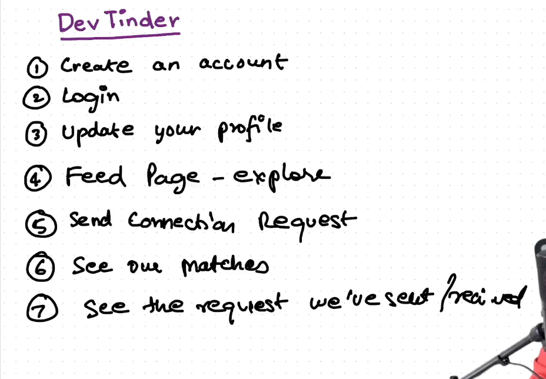
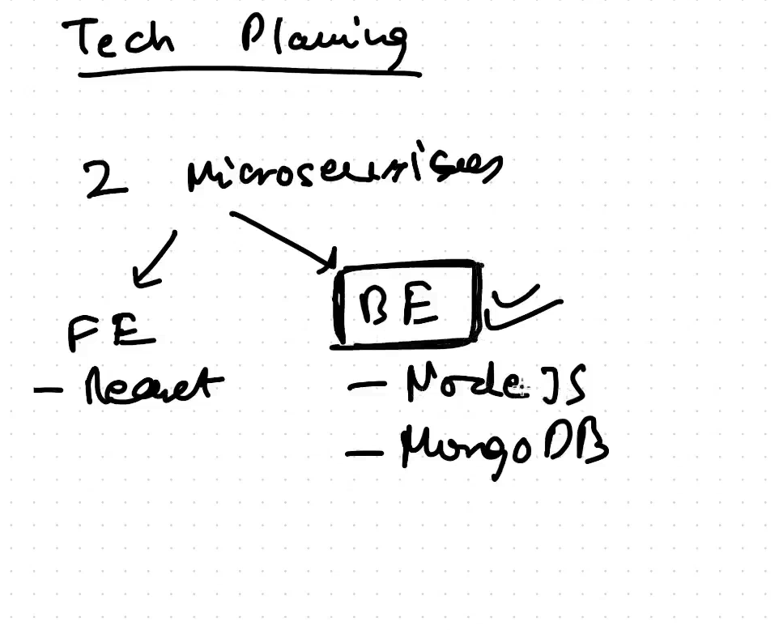
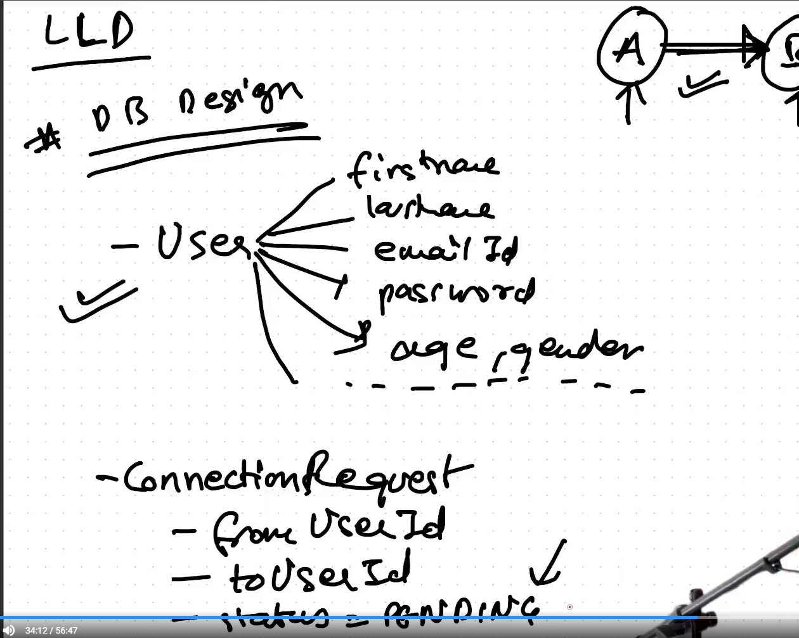
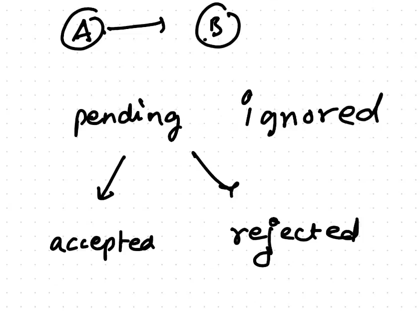
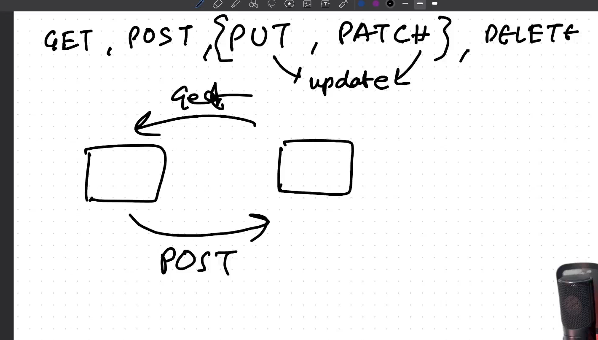
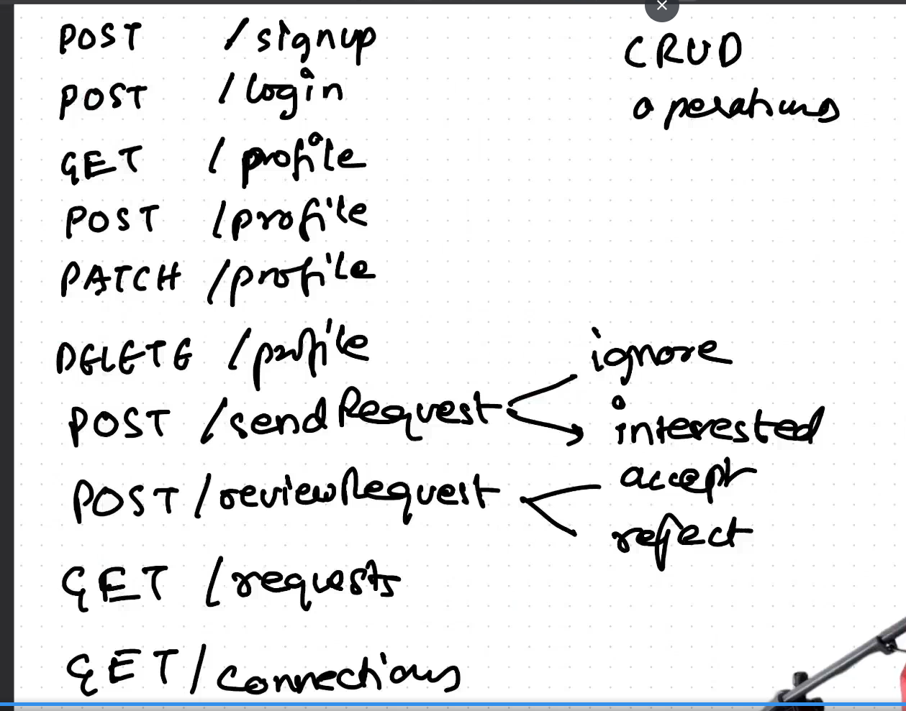

1. Lets go throught the tinder.com and take the inspiration that what the feature we can add for devtinder.

Gather information

2. The engineer team will read the requirement and try to do high level design(HLD) of this project.

3. LLD

4. API DESIGN  

