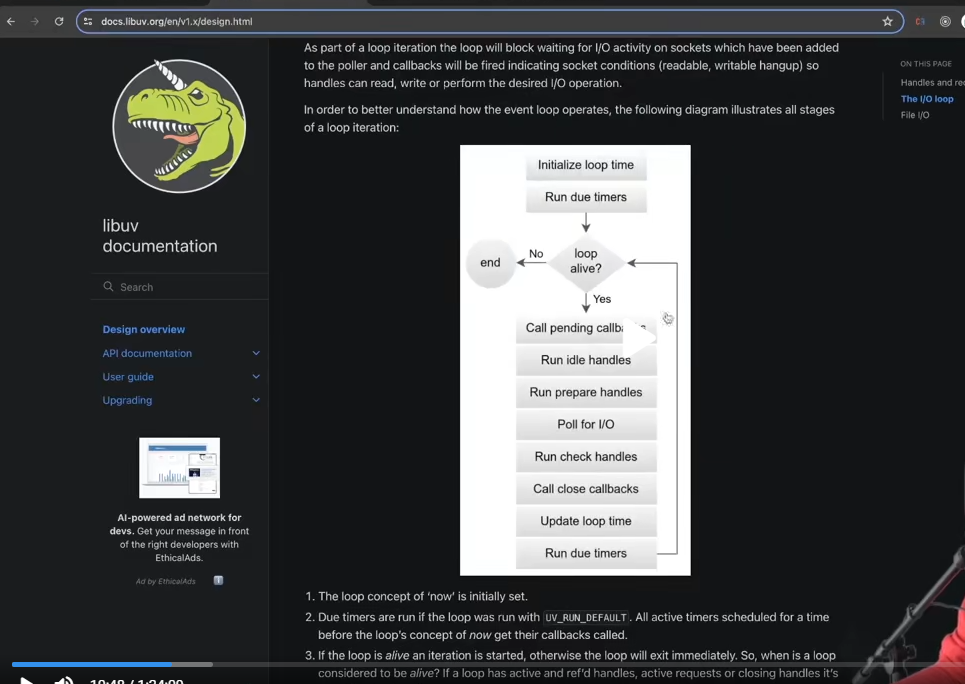
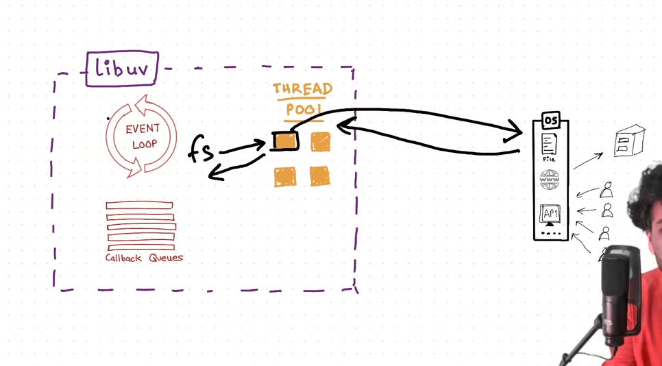
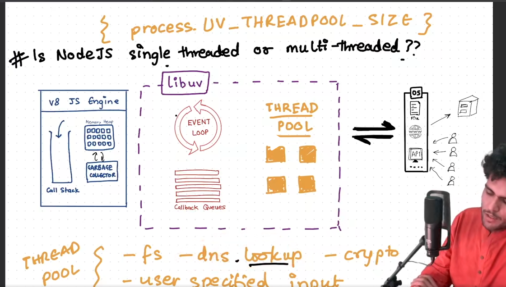
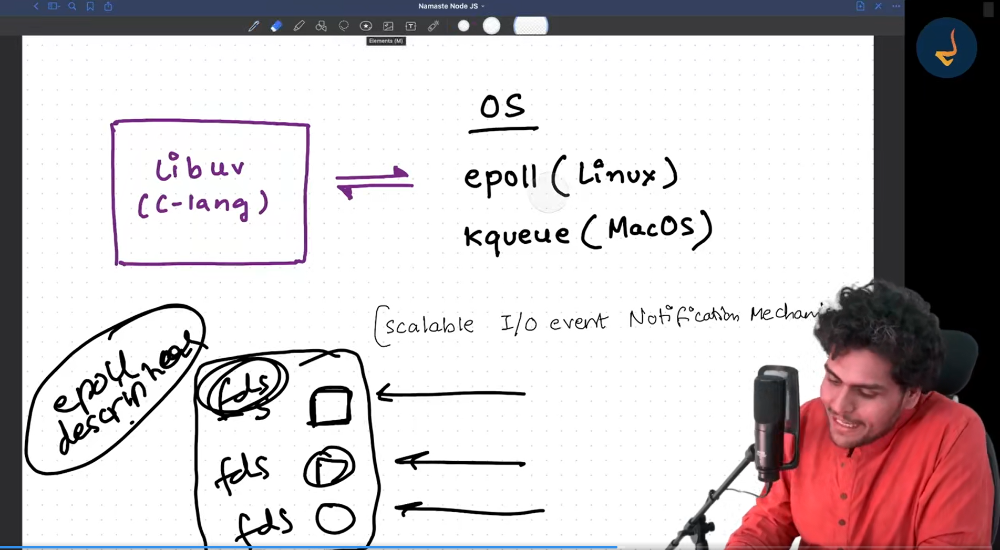
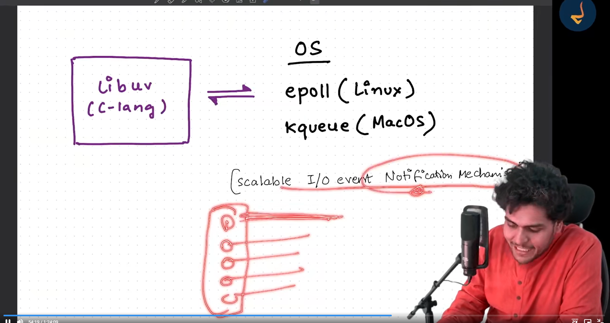
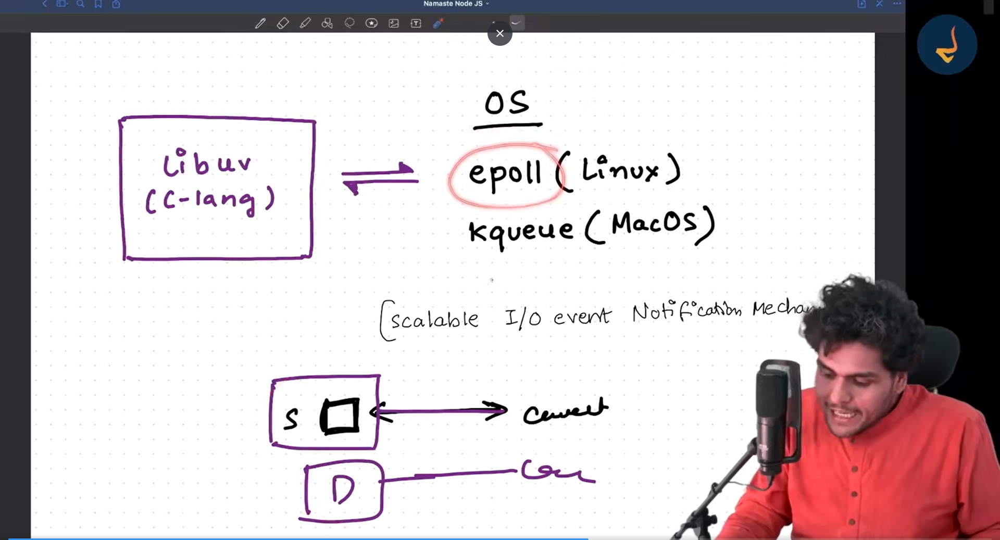
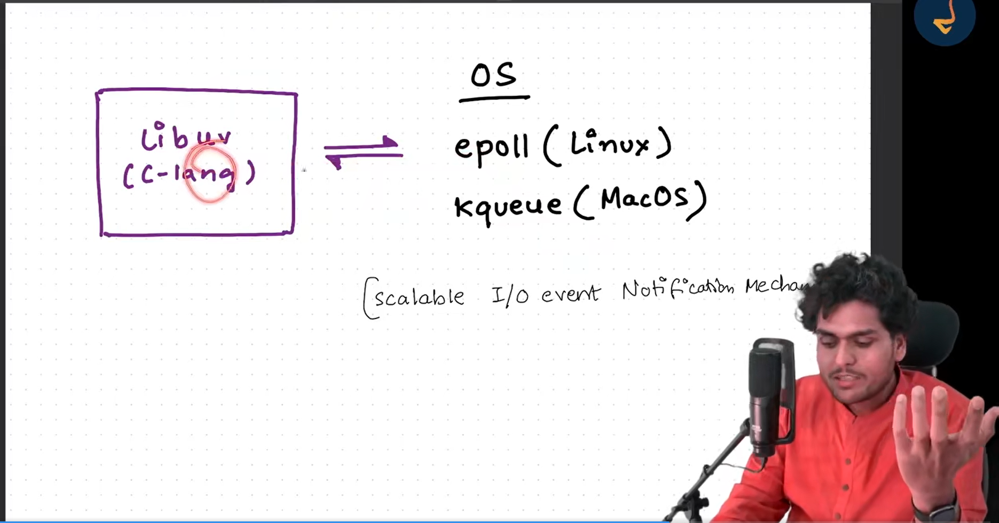
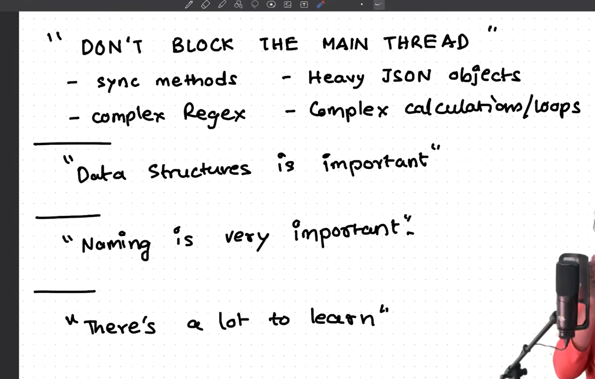

1. One cycle of the loop is known as tick.

2. There are 2 more phase other then the 4 we have seen.
   - Idle and Prepare
   - Pending callback phase

   

   

   check for DNS lookup
   

Node Js is single threaded or multi Threaded?

it depends based on the code

when the code is synchronous then its single threaded.
when the code is asynchronous then its muti threaded.

process.env.UV_THREADPOOL_SIZE = 10;
now 10 threads will be alloted to 10 different crypto calls.

so if your server needs to do lot of work that depends on the thread pool then you should increase the thread pool size.

Does API call uses thread poll?

No, it does not.
API calls does not use thread poll because it is handled by the OS kernel. And OS kernel is single threaded.

how does libuv communicates with operating system?
 
 All the networking happens in the sockets. Each socket has the socket descriptor/file descriptor..
 suppose the connection is made now you want to do write operation, you cannot do anything on the thread, suppose you   get thausand request will you going to make the thausand thread?
  
 No we doesn't going to create the thausand thread. The nodejs doesn't do that. Inside the operating system there is some thing called epoll

epoll is algorithm used in the linux and kqueue is used in MacOS. It is a scalable I/O event mechanism.
suppose there are multiple request is coming in, each of them has socket descriptor with it. Now you can create a epoll descriptor, that is a collection of socket descriptor. One Epoll descriptor can handle multiple socket connection.

Inside your operating system there is ahardware. on top of hardware there is kernel. On top of kernel there runs the processes.
At kernel level there are epoll mechanism are there.
so at kernel level there is scalable I/O event notification mechanism. so that you bacically create a epoll descriptor. these can hanve multiple file descriptor. suppose the connection is made, its not like it always writing to the     connection.
some times the connecion is made and waiting there for read and write. so there is a epoll descriptor which manages lot of connetions

as this is a scalable I/O event notification mechanism. so as soon as any activity happens on this connection, it will notify the libuv.
so libuv uses epoll as soon as anything happens in the connection. it will notify the libuv, and libuv will process the callback, and send it to the JS Engine using event loop.

libuv is writtten in c language that interact with the operating system.
lot og the things are haoppened at kernel level and everythign happens inside the operating system. so whenever some things change the operating system notifies the liuv this is why its called event driven architecture.

read about this
There are event emitters, streams & buffers, pipes, datastrucure usefd by epoll, fds - socket descriptor
why epoll uses read black tree, what is read black tree, how  it helps the epoll to operates in O(1)

at operating system level this epoll and kqueue are doing asynchronos operations

Don't Block the main thread
  - don't use the sync method always prefer async method
  - heavy JSON objects - don't use JSON.stringify or parse on large json objects.
  - complex Regex - don't use complex regex, it can block the main thread.
  - Complex calculations / loops

  

Data structure is important.

whenever you schedule the timer, 
Ex - for 5sec, 10sec
so datastrucutre used behind the schene to manages this setTimer queue is, its uses the min-heap
lets 
explain what is min heap

Naming is important
ex - process.nextTick vs setImmediate
from the name of process.nextTick it seems like it should get resolved in next tick, but it runs before each phase.
but setImmediate shoud happens immediately but it happens in next tick. This is because of the names are not descriptive.

There is lot to learn

