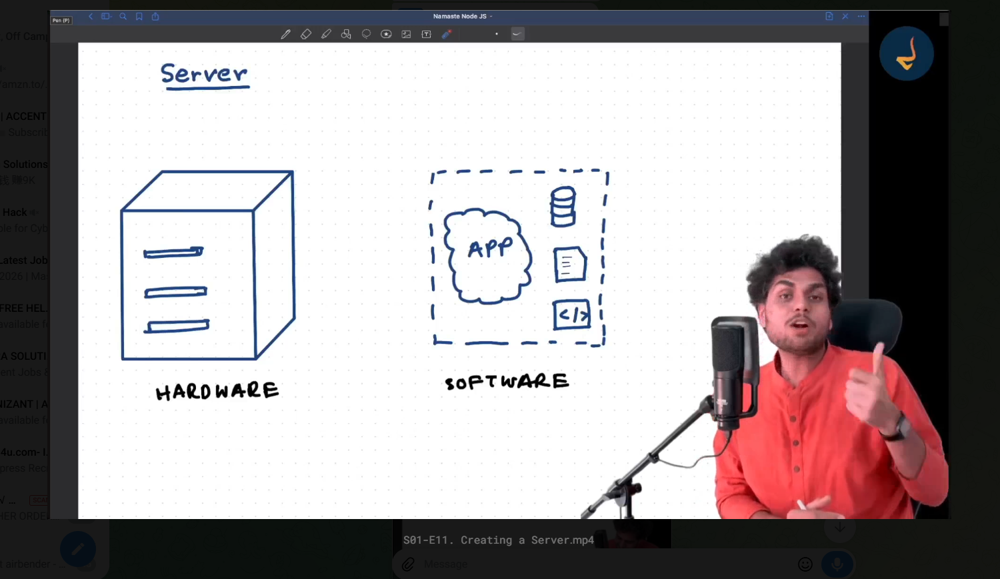


What is Server?

The word sever is some times used for the hardware and some times for the software and some times its used for the application.

server can be both hardware and software

If somebodys says deploy a app to server, what that means?
it means its refering to the hardware, hardware has the operating system.
when we deploy an application on the server, it basically means that running that application on that operating system. that application serves the client who wants to connect to our server. The hardware will have lot of the files and data and lot of memory. to access this memory outside of the world we need an application.

so inside the hardware, you will be having RAM, ROM, storage, data, so this is inside the small little computers. to get connected with this computer from outside the world and access this files, you need to run an application inside the hardware that can process the request made by users, and send the data accordingly. 
so for that we need an application that runs on the operating system. so this application(software) gets deployed on the hardware.
sometimes we refer to the application deployed on the hardware as server. and sometimes we refer hardware machine as server.
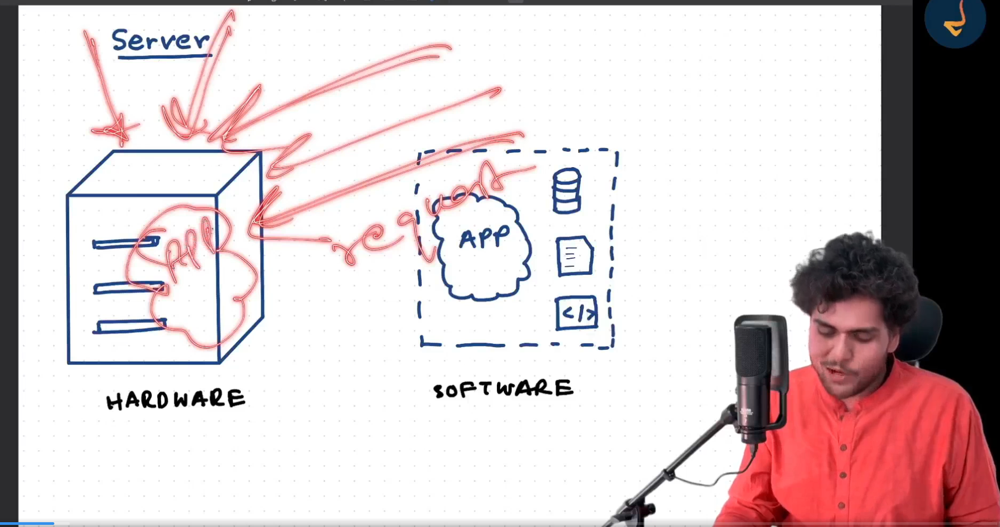

sometimes we say that we have server on AWS. so here AWS managing this hardware and aws is giving you the hardware resource and you are deploying your application on the hardware.

AWS is also having computers, we are also having computers, how our computers is different then AWS computers?
on groud level there is no difference.
I am also running some operating system in my computer, they also running the operating system in computers.
why do we use aws and can we use our computer as server?


we can use our computer as server, but it has some limitation.

when you take the server form AWS (EC2 Instance)
EC2 instance is ment to be server on AWS. There must be a CPU which on internet, managed by AWS, I have takes/using that resources for myself, deployed my application on that. so its managing the hardware and software part. whenever you hit namashte.dev.com it hits the server of AWS.

But why I cannnot use my own laptop.

my laptop has limited storage and Limited RAM. but on aws, if we just click a button we can increase the limit of storage.
but we  cannot increase the hardsisk space of my laptop easily, we need to buy a new hardsik and install it in my laptop.

AWS server are always connected to the internet.24x7 no power cut.
can we have it for my laptop so that my laptop never shut down. no its not possible. If we can do that then we can host namashte.com on our laptop.

we have local internet connection like using jio, airtel etx, when we use this network thewy don't guarantee an IP. Ther is address of everything. This IP address is not dedicated. Its not reserved for your computers, your IP can change. but on AWS you get dedicated IP. That's why we offloads everything to AWS server.


1. Our Computer is not having good internet connection.
2. Our Computer is not having good enough RAM.
3. Our Computer is not having good enough Storage.
4. Our Computer is not having good enough CPU.
5. Our Computer is not having good enough GPU.
6. Our Computer is not having good enough cooling system.
7. Our Computer is not having good enough power backup.
8. Our Computer is not having good enough security.
9. Our Computer is not having good enough redundancy.
10. Our Computer is not having good enough network infrastructure.
11. Our Computer is not having good enough availability.

AWS has a data centers, its like a big rooms that has lot of computers, lot of storage, lot of memory. and lot of network infrastructure. 
if they have power outage then they have power backup. 

if they have internet outage then they have internet backup.

AWS have 11 region, in India there is 2 region, Mumbai and Hyderabad. in Mumbai there is 3 availability zone.


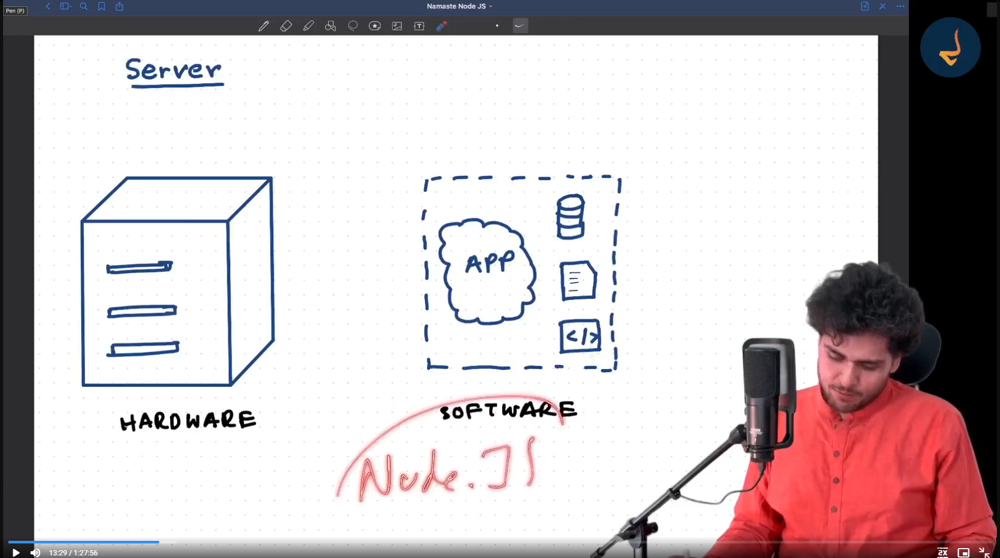


You might have heared that we are using node to create web server. we are creating the HTTP server, that means we are creating the server application which handle trhe user request.


Client-Server Anchitecture

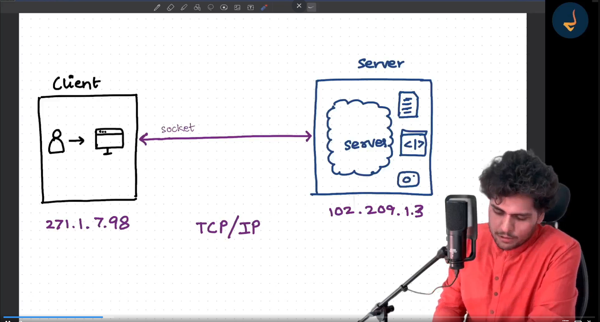
Client: is some one who is accessing your server.

server can have files, code and photos, documents, video. everything.
suppose a user has his computer, on that computer he has the browser and he wants to acccess some files from server, how he can do that.

Every client has some IP address and every server has some IP address. so both client and server are some computers that running operating system, but we call first computer as client, because its requesting some data and its using browser, so some time we call this client as browser.
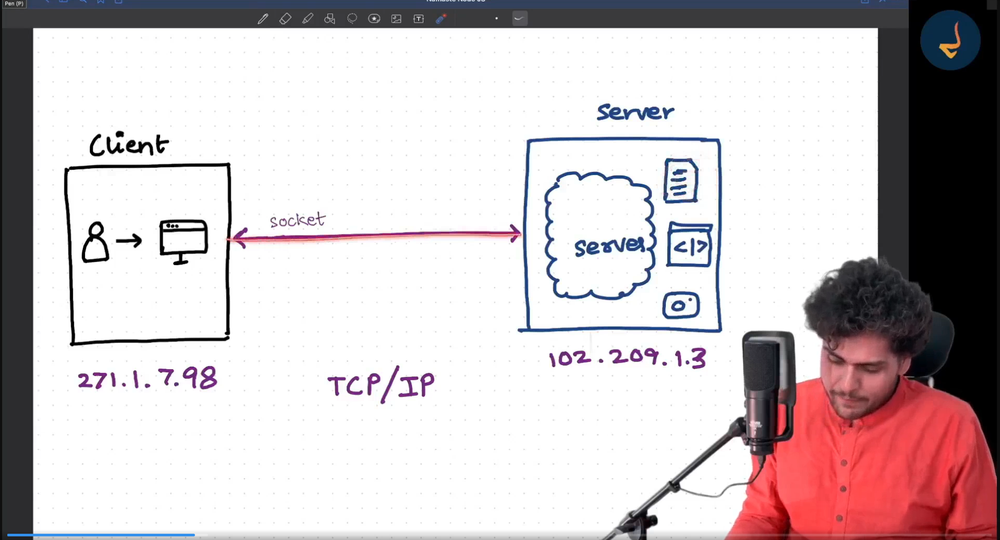
so to access the file we open the socket connection, somebody should be there to listen to it. This application over the server is called as server program. 
when we say the client is connecting with server, think like there is application that handling those incoming request.
there can be multiple client, each clinet will make the socket connection and get the data.

when client Request something, it will get the socket connection, server fetches the data and return back. and then socket connection is closed.
suppose the client has to make another request, makes another socket connections, get the data and close the soket connectinon.

when the socket connection is made it uses TCP/IP protpcol.

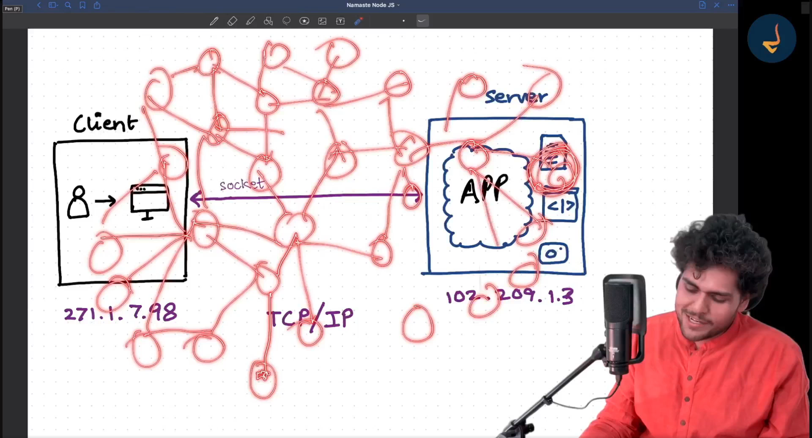

 do you know why it is called a web suppose there are so many peoples and peoples having different computers and all these computers are connected to the internet if all are connected to the internet every computer will have an IP address to locate and specify the computer because all of them are on  internet with that unique IP they can connect with any another IP, other person can connect with another Ip that's why it is known as web so anyone can connect with anyone via Internet.


Protocol is a set of rules that computers have decided to communicate using this rules.

  whenever you heard the word protocolt a set of rule that is used to define computers to connect. if one computer wants to connect with another computers that then they should communicate with similar language and that's called protocol.

  When a client makes a socket connection, there are different protocol or rules in which the server will sent there response in.
  these rules are HTTP, FTP, SMTP.


  HTTP: hyper text transfer protocol
  FTP: file transfer protocol, suppose if server only serves the files, then you can use this protocol to send/recive files.
  SMTP: simple mail transfer protocol, suppose you want to send the email, you need specific format to send the data, the mail server will use this protcol to send the mail.
  you can think of this as different language in which they agreed to communicate.


  whenever we talk about webserver we spcifically talk about http server.
  suppose

   suppose you want to send some text suppose you want to send some HTML suppose you want to send some JSON, suppose you want to send some basic data that is done using HTTP, you can assume http as a language that all the client - server can communicate
   so normally whenever we create the web server it uses the HTTP protocol.

    the work of server is to get the listen the incoming request, process it and return the data, it always active and waiting for incoming request and making socket connection.


     in browser you have seen like we are writing http or HTTPS so whenever you see http that means we are making HTTP request. this is kind of a language that be used to communicate with server
     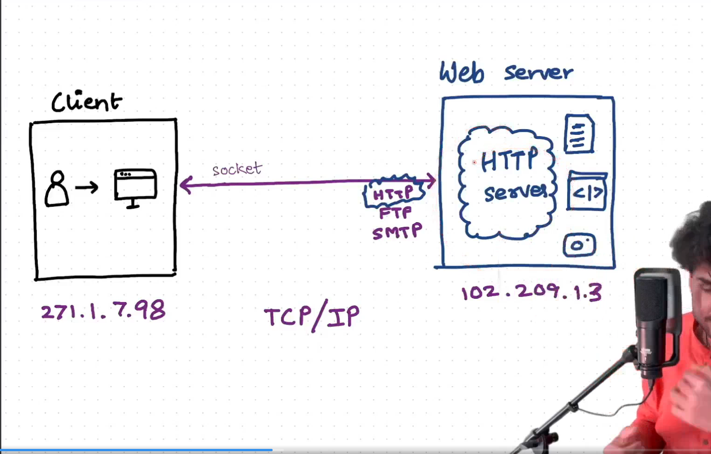


      now when you make a server request how the data send, data is not send directly in one go like user is requesting for some file, and it send the whole file at once. this is not the way it never happen like this it happens in the terms of chunks and this is known as packet as we are using HTTP protocol and whenever we are sending the data send this in chunks called packets.

      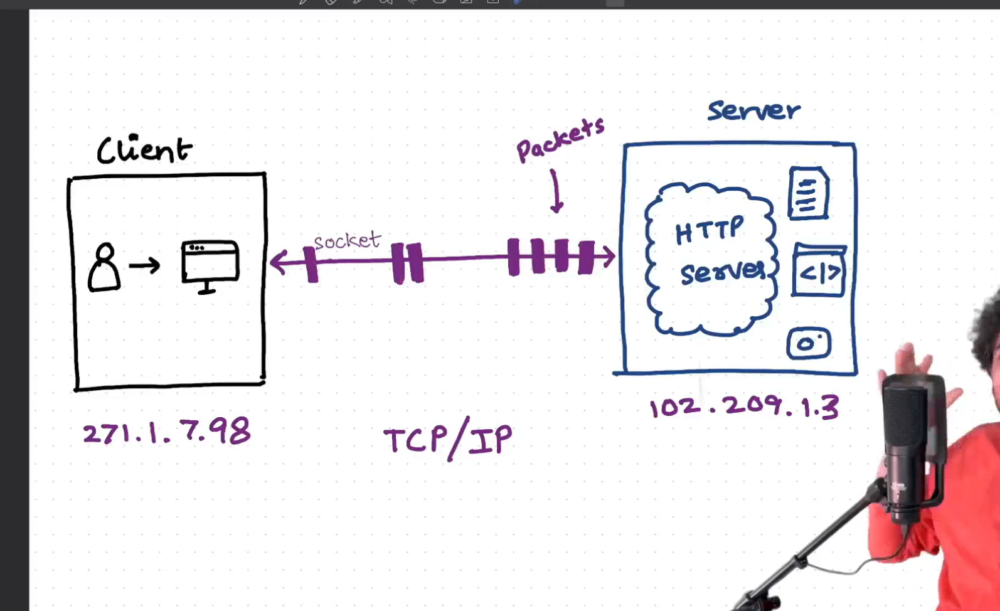

      Its like streams of chunks.

      TCP/IP is a protocol that is used to send the data in chunks.


      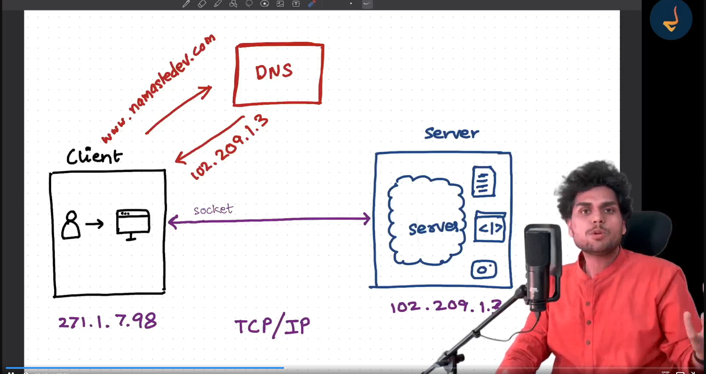

      ## Domain Name and IP Address

Generally, when we communicate with a server on the internet, we use its **domain name** rather than directly using its IP address.

For example:

```text
www.example.com
```

is easier for humans to remember than:

```text
93.184.216.34
```

However, at the network level, communication ultimately happens using **IP addresses**.

You can think of it like a physical address.

Suppose someone wants to send a letter to you. They might know your:

```text
Name → Rishav
City → Patna
State → Bihar
Country → India
```

But to actually deliver the letter, a specific physical address is required.

Similarly:

```text
Domain Name → Human-friendly name
IP Address  → Network address
```

When we enter a domain name in the browser:

```text
www.example.com
        ↓
      DNS
        ↓
   IP Address
        ↓
   Server
```

DNS (**Domain Name System**) translates the domain name into the corresponding IP address.

So, when we make a request:

```text
https://example.com
```

the browser first performs DNS resolution to find the server's IP address. It can then establish a network connection with that IP address.

### Simple Mental Model

```text
Domain Name
(Human-friendly)
      ↓
     DNS
      ↓
IP Address
(Machine/network address)
      ↓
    Server
```

> **Domain names are designed for humans to remember, while IP addresses are used by the network to locate and communicate with the destination.**


## Can We Create Multiple Servers?

Yes, we can create multiple servers.

For example, we can create multiple **HTTP servers**. In the context of Node.js, this could mean running multiple Node.js applications, each with its own HTTP server.

For example:

```text
Server / Computer
│
├── Node.js Application 1
│      └── HTTP Server → Port 1001
│
├── Node.js Application 2
│      └── HTTP Server → Port 3000
│
└── Other Applications
```

Now suppose a user sends a request to:

```text
102.209.1.3:3000
```

Here:

```text
102.209.1.3 → IP address of the machine
3000         → Port number
```

The **IP address identifies the machine**, while the **port number identifies which application/service on that machine should receive the network connection**.

For example:

```text
102.209.1.3:1001
        ↓
Node.js Application 1

102.209.1.3:3000
        ↓
Node.js Application 2
```

So, when a request arrives at:

```text
102.209.1.3:3000
```

the operating system looks for the application that is listening on port `3000` and delivers the connection to that application.

### Can multiple applications run on the same computer?

Yes.

A single computer/server can run many different applications or services, such as:

```text
Computer / Server
│
├── HTTP Server       → Port 3000
├── Another HTTP App  → Port 4000
├── Database Server   → Port 5432
├── File Server       → Port 5000
└── Other Services    → Different ports
```

Each network service can listen on a different port.

### Important Distinction

We should distinguish between **server, application, and port**:

```text
Server / Computer
       ↓
   IP Address
       ↓
  ┌────┴──────────────┐
  ↓                   ↓
Port 3000          Port 4000
  ↓                   ↓
App A                App B
```

So:

> **The IP address identifies the machine, and the port identifies the network service/application on that machine.**

This is why multiple Node.js applications can run on the same server: **they can listen on different ports.**

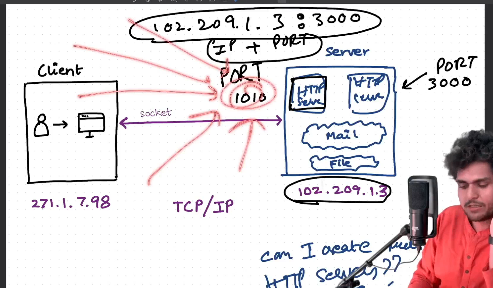


## Domain Name, IP Address, Port, and Path

A **domain name** maps to an **IP address** through DNS.

For example:

`namastedev.com` → `123.4.5.6`

The **IP address** identifies the machine/server where the application is running.

When we combine the **IP address + port**, we can identify a particular network service/application running on that machine.

For example:

`123.4.5.6:3000`

Here:

* `123.4.5.6` → identifies the machine/server
* `3000` → identifies the port where a particular application/service is listening

Now suppose our Node.js application is running on port `3000`.

When a request comes with a path such as:

`/api`

the request reaches the application running on port `3000`.

Inside the application, the **path (URL route)** is used to decide which piece of code should handle the request.

For example:

```text
namastedev.com
       ↓
     DNS
       ↓
  123.4.5.6
       ↓
  123.4.5.6:3000
       ↓
   Node.js Server
       ↓
      /api
       ↓
  API route handler
```

If we have another path:

`/api/users/info`

the Node.js application can have a route such as:

```js
app.get('/api/users/info', (req, res) => {
    // Code for getting user information
});
```

So the overall flow is:

```text
Domain Name
    ↓
DNS resolves domain to IP
    ↓
IP Address identifies the machine
    ↓
Port identifies the network service/application
    ↓
Path identifies the route inside the application
    ↓
Route handler executes the corresponding code
```

### Simple Analogy

Think of it like an address:

```text
Domain       → Building address
IP Address   → Actual network address of the machine
Port         → Particular office/service inside the building
Path         → Specific room/function inside that service
```

For example:

```text
https://namastedev.com/api/users/info
        ↓
      Domain
        ↓
    DNS → IP
        ↓
  IP + Port
        ↓
    Application
        ↓
      /api/users/info
        ↓
    Route Handler
        ↓
    Execute Code
```

**Important:** The port does not technically mean "this should be the server." More accurately, the port identifies the **network service/application listening on that port**.

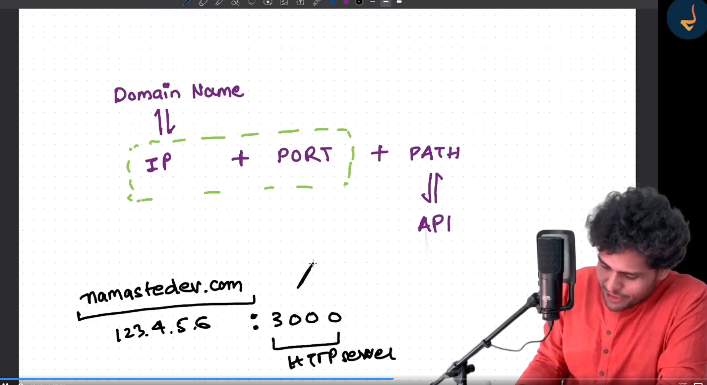


## Multiple Applications on the Same Domain

It is possible to run multiple applications on the same machine and expose them through the **same domain**.

For example, suppose we have:

`namasteweb.com`

We have two applications:

```text
React Application → Port 3000
API Server        → Port 4000
```

Internally, they are running on different ports:

```text
123.4.5.6:3000 → React Application
123.4.5.6:4000 → API Server
```

Now suppose users access:

```text
https://namasteweb.com/
```

We want this request to go to the **React application**.

And when users access:

```text
https://namasteweb.com/api/users
```

we want this request to go to the **API server**.

A **reverse proxy** such as Nginx can handle this routing:

```text
                    namasteweb.com
                          │
                          ▼
                    Reverse Proxy
                       (Nginx)
                     /          \
                    /            \
                   ▼              ▼
                  /              /api
                  │                │
                  ▼                ▼
           React App :3000     API Server :4000
```

So:

```text
https://namasteweb.com/
        ↓
   Reverse Proxy
        ↓
   localhost:3000
        ↓
   React Application
```

And:

```text
https://namasteweb.com/api/users
        ↓
   Reverse Proxy
        ↓
   localhost:4000
        ↓
   API Server
```

### Important Concept

The **domain itself does not map `/` to port 3000 and `/api` to port 4000**.

Instead:

* **DNS** maps the domain to an IP address.
* **The reverse proxy** receives the request.
* **The reverse proxy looks at the path** (`/`, `/api`, etc.).
* It then forwards the request to the appropriate application/port.

For example:

```text
namasteweb.com
      ↓
DNS
      ↓
123.4.5.6
      ↓
Reverse Proxy
      │
      ├── /      → React App :3000
      │
      └── /api   → API Server :4000
```

### Why Use This?

This allows multiple applications/services to appear under **one domain**.

The user only sees:

```text
namasteweb.com
namasteweb.com/api
```

while internally we can have:

```text
React      → :3000
Node API   → :4000
```

So the **reverse proxy acts as the entry point** and decides which internal application should receive each request.

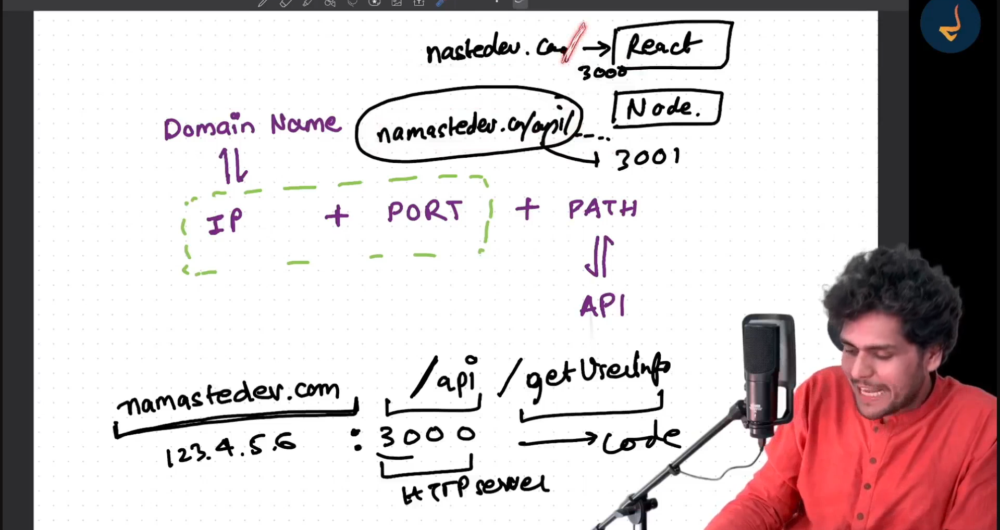


## How Different Servers Communicate in a Real Application

Suppose there is a large company with a web application.

The company may not keep everything on a single server. Different responsibilities can be handled by different servers or machines.

For example, they may have:

* **Application server** → runs the frontend and backend application
* **Database server** → stores application data
* **File/Storage server** → stores images, videos, documents, etc.
* **Backup server/storage** → stores backups of important data

### Example Architecture

Suppose we have:

`namastestudio.com`

The architecture could look like this:

```text
                    Client / Browser
                           │
                           ▼
                  Application Server
                 ┌─────────┴─────────┐
                 │                   │
             Frontend             Backend
                 │                   │
                 └─────────┬─────────┘
                           │
              ┌────────────┼────────────┐
              ▼            ▼            ▼
         DB Server    File Storage   Other Services
                       / Media Server
```

The frontend and backend may run on the same server, while the database and media files are stored on separate servers.

For example:

```text
Application Server → Frontend + Backend
Database Server    → Database
Media Server       → Images + Videos
Backup Storage     → Database/File Backups
```

### What Happens When a Client Makes a Request?

Suppose a user opens:

`namastestudio.com`

The request first reaches the application server.

If the frontend needs some data, it may call the backend API:

```text
Client
  ↓
Frontend
  ↓
Backend API
```

Now suppose the API needs user information from the database.

The backend communicates with the database server:

```text
Client
  ↓
Frontend
  ↓
Backend API
  ↓
Database Server
  ↓
Database
```

The database returns the required data to the backend, and the backend sends the response back to the client.

### Requesting a Video

Now suppose the user wants to watch a video.

The video itself may not be stored on the application server. It may be stored on a separate **media server or object storage system**.

The flow could be:

```text
Client
  ↓
Frontend
  ↓
Backend/API
  ↓
Media Storage
  ↓
Video
  ↓
Client
```

Similarly, images can be stored separately:

```text
Client
  ↓
Frontend
  ↓
Image Storage / Media Server
  ↓
Image
  ↓
Client
```

In modern systems, this storage is often provided by services such as object storage rather than a traditional file server.

### Why Not Put Everything on One Server?

If we put the frontend, backend, database, images, and videos on a single server, several problems can occur.

For example:

* The server can become overloaded.
* Large files can consume a lot of storage.
* Database operations can compete with application operations.
* A failure of the server can affect the entire system.
* Scaling individual components becomes difficult.
* Backups and maintenance become harder.

Separating responsibilities allows each component to be managed and scaled independently.

### Important Concept

Even though these are different servers, they are ultimately **computers connected through a network**.

They communicate with each other using standard networking protocols.

For example:

```text
Frontend Server
       │
       │ HTTP/HTTPS
       ▼
Backend Server
       │
       │ Database Protocol
       ▼
Database Server
```

And:

```text
Backend Server
       │
       │ HTTP/HTTPS or storage protocol
       ▼
Media Storage
```

Each machine or service can have a network address, such as an **IP address**, and applications communicate using **network protocols**.

### Big Picture

A real-world application can therefore look like this:

```text
                         Internet
                            │
                            ▼
                     Client / Browser
                            │
                            ▼
                   Application Server
                  ┌─────────┴─────────┐
                  │                   │
              Frontend             Backend
                                      │
                       ┌──────────────┼──────────────┐
                       │              │              │
                       ▼              ▼              ▼
                  DB Server      Media Storage    Other APIs
                       │
                       ▼
                    Database
```

So, the important idea is:

> **A large application does not have to run everything on one computer. Different responsibilities can be handled by different servers or services, and these computers communicate with each other over a network using standard protocols.**

## Socket vs WebSocket

### What is a Socket?

A **socket** is a communication endpoint that allows two computers/processes to communicate over a network.

For example, when a browser communicates with a backend server using HTTP, a network connection is established between them.

Conceptually:

```text
Browser
   │
   │ Network Connection
   ▼
Server
```

The socket is part of the underlying network communication.

### Normal HTTP Communication

In a traditional HTTP request-response model, the client sends a request and the server sends a response.

For example:

```text
Browser
   │
   │ HTTP Request
   ▼
Server
   │
   │ HTTP Response
   ▼
Browser
```

Suppose we request:

```text
GET /blog
```

The browser sends the request to the server, and the server returns the required HTML/data.

Depending on HTTP version and connection settings, the underlying TCP connection may be reused for multiple HTTP requests or may be closed after the exchange. Therefore, it is not always correct to say **"one HTTP request creates a socket and immediately closes it."**

For example, when navigating through a website, the browser may make many requests:

```text
GET /
GET /blog
GET /api/users
GET /images/logo.png
GET /styles.css
```

Connections can be reused rather than creating a completely new TCP connection for every request.

---

## What is WebSocket?

**WebSocket is a communication protocol designed for persistent, two-way communication between a client and server.**

Once a WebSocket connection is established, both sides can send messages whenever they need to.

```text
Client  ◄──────────────►  Server
       persistent connection
```

Unlike the normal HTTP request-response model, the server does not have to wait for a new request from the client before sending a message.

For example:

```text
Client → Server: Connect
Server → Client: Connection established

Client → Server: Message
Server → Client: Message

Server → Client: New notification
Server → Client: New message
Server → Client: Updated data
```

The connection can remain open for a long time.

---

## Real-World Example: Chat Application

Suppose we build a chat application.

Without WebSocket:

```text
Client
  │
  │ "Do I have a new message?"
  ▼
Server
  │
  │ "No"
  ▼
Client

Client
  │
  │ "Do I have a new message?"
  ▼
Server
```

The client would have to repeatedly ask the server for updates. This is called **polling**.

With WebSocket:

```text
Client ◄══════════════════► Server
          connection
             stays open

Server ─────────► Client
     "New message!"
```

The server can immediately send a message when something happens.

This makes WebSockets useful for:

* Chat applications
* Live notifications
* Multiplayer games
* Live dashboards
* Real-time collaboration
* Live tracking
* Real-time updates

---

## Where Does Socket.IO Fit?

**Socket.IO is a library/framework that provides real-time, event-based communication between the client and server.**

It commonly uses WebSocket when available, but Socket.IO is **not the same thing as WebSocket**.

For example:

```js
// Server
io.on("connection", (socket) => {
    console.log("User connected");

    socket.on("message", (message) => {
        console.log(message);
    });
});
```

Here:

* `io` → Socket.IO server
* `socket` → represents a connected client
* `socket.on()` → listens for events
* `socket.emit()` → sends events

Socket.IO also provides features such as reconnection, rooms, namespaces, and event-based communication.

---

## Socket vs WebSocket

| Socket                                            | WebSocket                                                                                  |
| ------------------------------------------------- | ------------------------------------------------------------------------------------------ |
| General network communication endpoint            | Specific communication protocol                                                            |
| Can be used with TCP/UDP depending on socket type | Usually runs over TCP                                                                      |
| Lower-level networking concept                    | Higher-level protocol                                                                      |
| Used internally by many networking systems        | Designed for persistent two-way communication                                              |
| HTTP can use TCP sockets underneath               | WebSocket starts with an HTTP-based handshake and then upgrades to WebSocket communication |

### Simple Mental Model

Think of it like this:

```text
Socket
  ↓
A communication endpoint

WebSocket
  ↓
A specific protocol for
long-lived, two-way communication
```

And:

```text
HTTP
Client ──────► Server
       Request
Client ◄────── Server
       Response


WebSocket
Client ◄════════════► Server
      Long-lived
      two-way connection
```

### Important Correction

Do **not** think:

> "Normal HTTP uses sockets, and WebSocket is a socket that stays open."

A better understanding is:

> **A socket is a network communication endpoint. HTTP and WebSocket are protocols that can use a network connection. WebSocket specifically provides persistent, bidirectional communication between the client and server.**

Also, **WebSocket does not exist because servers have a limit on the number of connections**. In fact, WebSocket connections remain open, so a server must manage potentially many concurrent connections efficiently. Its main purpose is to enable efficient **real-time, bidirectional communication**, not to reduce the number of connections.


lets create server
NodeJs has HTTP module, gives us access to the function name createServer, once you create the server you can listen the request.

when we are saying that creating a server it means we are creating this application. which can able to listen to the request.


req.end means sending the data back. this is the last of cycle, of the request 

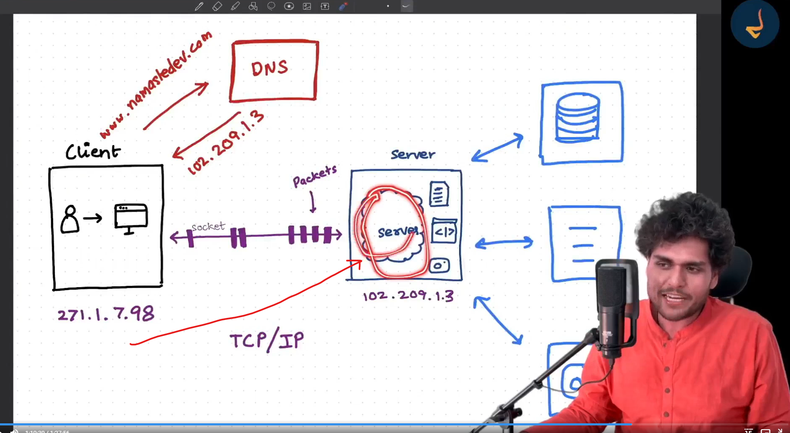

when we start the server you will see the terminal is busy and waiting for the request to come in.

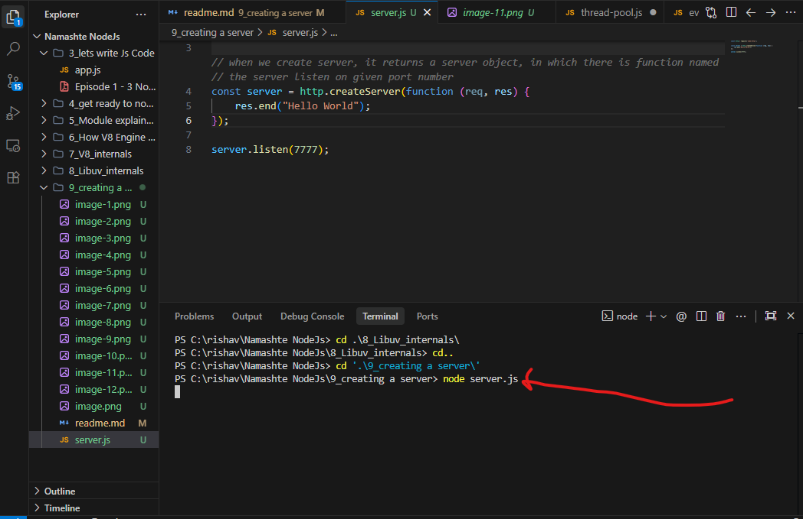

now if you deploy this to aws machine, the pepole can use the IP of aws machine to make request.

suppose if want some extra path, how will you handle this request, 
you can directly say that if req.url === is the '/getsecretdata', then send 

its very hard to create the server using nodejs and handling different routes, and extra features, that's why we use express.js
Express is a frame work which is built on top of nodejs. 

In MERN - Node is the language, express is the framework that we are going to use.


