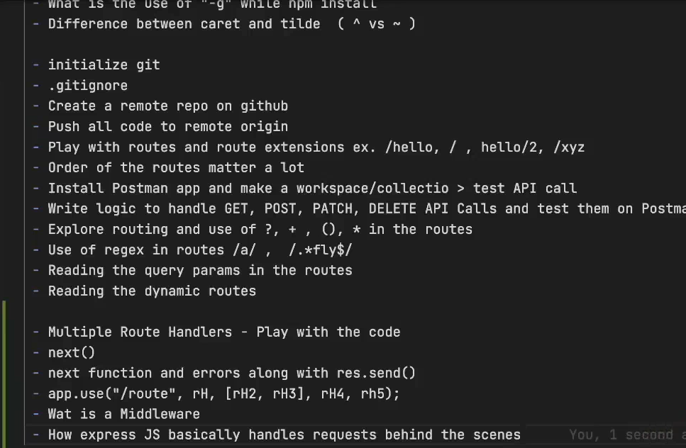
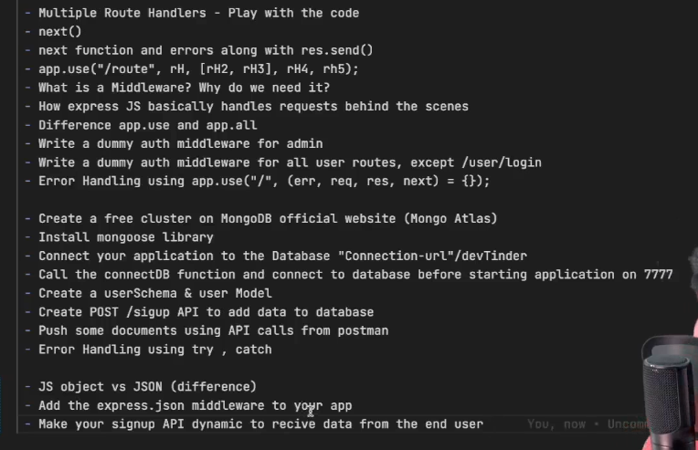
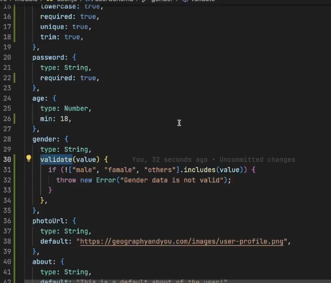
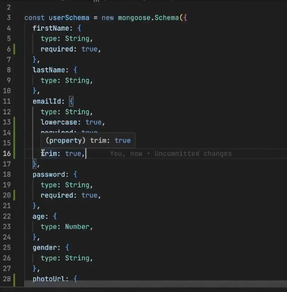
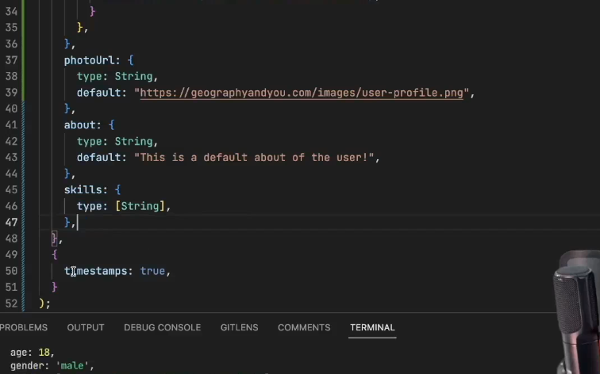
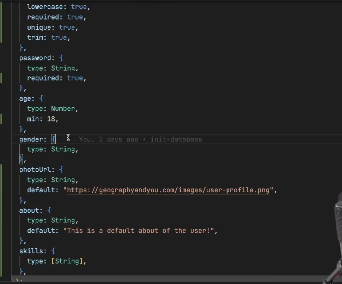
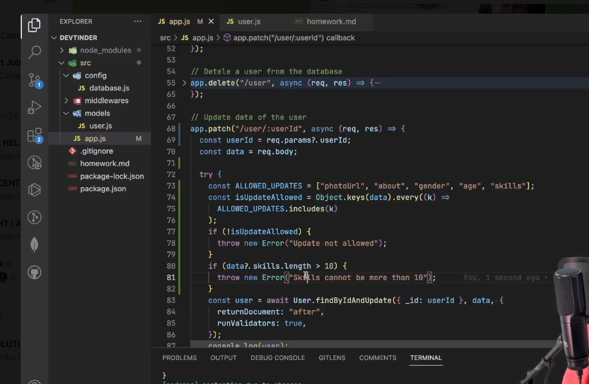
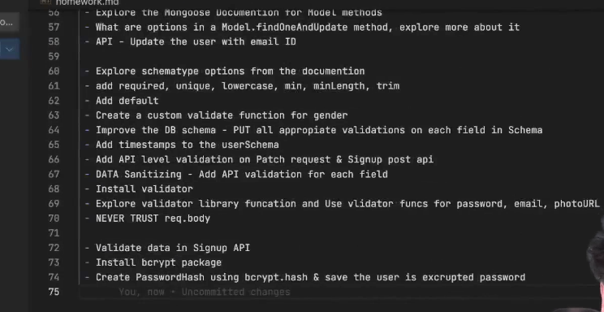
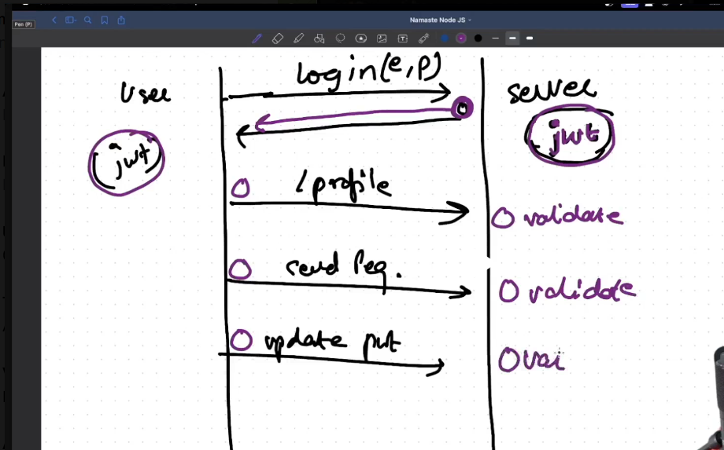

- Create a repository
- Initialize the repository
- node_modules, package.json, package-lock.json
- Install Express
- Create a server
- Listen to port 7777
- Write request handlers for /test, /hello
- install nodemon and update scripts inside package.json
- difference b/w caret(^) and tilde(~) 
- What are dependecies?

Routing and request handlers
- when you use app.use() it will match all the HTTP menthod API calls to /test

playing with the routes

when you use app.use() it will match all the HTTP menthod API calls to /test
app.use('/test', (req, res) => {
    res.send("Hello Rishav")
})

app.use('/hello', (req,res)=> {
    res.send("hello")
})

app.use('/', (req,res)=> {
    res.send("Abra ka dabra")
})

app.use('/user', (req,res, next)=> {
    res.send("Hello there")
})

app.get("/user", (req, res)=> {
    res.send("User page hit")
})

app.post("/user", (req, res)=> {
    res.send("User page hit")
})

to read query params

app.get("/users", (req,res)=> {
    console.log(req.query);
    
    res.send("Query page hit")
})

dynamic route param

app.get("/users/:id/:name/:password", (req,res)=> {
    console.log(req.params.id);
    
    res.send("Query page hit")
})

on adding ? mark here, it means b can appear 0 or 1 time 
app.get("/abc", (req,res)=> {
    res.send("ab?c")
})

app.get(/.*fly$/, (req, res) => {
    res.send({ firstName: "Akshay", lastName: "Saini" });
});

 This is a regular-expression route.

 What does /.*fly$/ mean?
 .* → any number of any characters
 fly → must contain fly at the end
 $ → end of the URL/path

 So it can match:

 /fly
 /butterfly
 /dragonfly
 /hello-fly
 /anythingfly

 But not:

 /fly/test
 /butterfly/abc
 /flight

 if you don't return any thing from the route handler then it will go in to the infinite loop.
 ex -
 app.use("/users", (req, res)=> {

 })

 One route can have multiple route handler

 

 //  One route can have multiple route handler
//  as soon as you hit to the /user, it will go to the first route handler and execute the code line by line. because at the end its a js code that going to run by v8 engine, and v8 execute the code line by line. because Js is synchronous single threaded language.
// as soon as it will send the response from first route handler, it will not go to the next route handler. 

// lets consider if there is no res.send is present inside the first handler, then what happen, will it automatically gets inside the second handler and execute the line there?
// Ans: No it will not goes automatically inside the second handler, so express doesn't do this automatically. so express says that you havce one more parameter in the request handler known as next, and you can call this next() after excuting your lines inside the first handler, and then it will goes to the second handler and execute the lines inside the second handler. and so on.

// if you do both thing from the handler like
/**
 * res.send("response");
 * next();
 * 
 * then it will send the response and then goes to the next handler and run the code there as well, but when it finds the second res.send() function it will give the error,as it will try to sensd the another respose via same connection or url.
 * as we  know that when client send the request the TCP connection is made and when the response is send then the connection is losed.
 */

// EX: 1
// app.use("/user", 
//     (req, res, next)=> {
//         console.log("hello");
//         // res.send("Response 1!!"); // if doesn't send any response then your request will hang, unless you call next() so that the next handler can execute and send response
//         next();
//     },
//     (req, res, next)=> {
//         console.log("hello");
//         res.send("Response 2!!")
//     }
// )

// EX:2

// in this example, it will run the route handler code line by line, once it finds the next() function call inside the first handler, it will goes to the second handler and execute the lines inside the second handler, in the second handler, there res.send() is present, so it will send the response and then get back to the same first handler and will continue to execute the remaining lines inside that first handler, i.e. res.send("Response 1!!") and which will throw an error as it will try to send another response via same connection.

// you can attach as many request handler as you can

// app.use("/user", 
//     (req, res, next)=> {
//         console.log("hello");
//         next();
//         res.send("Response 1!!");
//     },
//     (req, res, next)=> {
//         console.log("hello");
//         res.send("Response 2!!")
//     }
// )

// EX:3
// It will give the error, because here express is expecting of another route handler as we are calling the next () inside the last handler.
// app.use("/user", 
//     (req, res, next)=> {
//         console.log("hello");
//         next();
//     },
//     (req, res, next)=> {
//         console.log("hello");
//         next();
//     }
// )

// you can also pass the array of handers and it will work same
// app.use("/user", 
//     [(req, res, next)=> {
//         console.log("hello1");
//         next();
//     },
//     (req, res, next)=> {
//         console.log("hello2");
//         next();
//     },
//     (req, res, next)=> {
//         console.log("hello3");
//         res.send("Response 3!!")
//     }]
// )

// this is also possible

// app.use("/user", 
//     [(req, res, next)=> {
//         console.log("hello1");
//         next();
//     },
//     (req, res, next)=> {
//         console.log("hello2");
//         next();
//     }],
//     (req, res, next)=> {
//         console.log("hello3");
//         res.send("Response 3!!")
//     }
// )

EX:4
app.get("/user", (req, res, next)=> {
   console.log("1st handler");
   next();
})

app.get("/user", (req, res, next)=> {
   console.log("2nd handler");
   res.send("Response from 2nd handler")
})

// this function that is being used in the middle of the request handler is known as middleware
// or the route handler which is calling to the next handler is known as middleware

// GET /users => middleware chain => request handler

// as we have used use and written at the top, so this will get called for all the routes that starts with /admin

// handle Auth Middleware for only GET, POST, DELETE methods
app.use('/admin', (req, res, next) => {
   const token = "xyz";
   console.log("Auth check")
   const isAdminAuthorized = token === "xyz";
   if (isAdminAuthorized) {
      next();
   } else {
      res.status(401).json({message: "Not Authorized"})
   }
})

app.get("/admin/getAllData", (req, res)=> {
   // here if I need to check the user is admin or not then we need to write the logic here as well as inside the other delete route as well, and this is DRY code violation. so to avoid this we can use middleware. we define a middleeare function inside a file and use it here.

   // const token = "xyz";
   // const isAdminAuthorized = token === "xyz";
   // if (isAdminAuthorized) {
   //    res.status(200).json({message: "Hello Rishav"})
   // } else {
   //    res.status(401).json({message: "Not Authorized"})
   // }
})

app.get("/admin/getAllData", adminAuth, (req, res)=> {
   return res.send("Hello Rishav from getAllData")
})

app.delete('/admin/deleteData', adminAuth, (req, res)=> {
   return res.send("Hello Rishav from deleteData")
})

Error handling
use try catch block to handle errors

but if there are some error that are not handled then ho you can handle that errors

order of this argument always matters : err, req, res, next
if using only 3 argument then order will be: req, res, next

this only works when its written at the bottom, and it not used the try/catch in the handlers. as code run top to bottom. if you write this at top then, when it runs at first there is no any error.

app.get("/admin/getAllData", adminAuth, (req, res)=> {
   throw new Error("from getAll Data")
   // return res.send("Hello Rishav from getAllData")
})

app.use("/", (err, req, res, next)=> {
    if (err) {
       res.status(500).json({message: "Something went wrong"})
    }
})

DATABASE

before listening to the server, first your database should be connected. It means as soon as the server start listening the user can start making the request, but what if server started listening and database still not connected then user will get the error. so to avoid this, what we will do is export the database connection function from database.js file and call it in app.js file before listening to the server, and use .then() and .catch() to handle the errors.

Difference between Javascript and JSON.
Json always need key as string.

As when you try to send the data from postman in the JSON format, our server is not capable to read the data in the JSON format by default. To read the JSON data we need the help of middleware. where it can read the data from the incoming request and convert it into Javascript object. There is already a middleware is given to us, whose name is express.json().

as we already know that, if we use app.use and don't pass any route path then, it will run for all the routes. so we will write app.use(express.json()) at the top of the file, and so it will run for all the routes.

Data Sanitization and Validation

 

The validate function check will only work when creating new document, not while updating existing data.To run the validation fot the existing data we have one option, inside the router file, we can pass one extra option in the findOneAndUpdate function, known as runValidators, and set it to the true

lets use the validator package to validate as well as sanitize the data

Never trust the req.body, as attacker can send any data in the api and that data can get stored in the database.

so the first step should be the validation of the data.

Encrypting Password

once data is validated then we need to encrypt the password.

when you encrypt a password it takes the password, the hashing algorithm, salting, etc

the salt means the number of round the salt should applied to the hash. Higher the salt, more secure the password will be.

salt can be a random value of any length. the standered hash value is 10.

once this password is encrypt, you cannot decrypt it.

 

 never disclose the extra information. if userEmail is not present in the DB, don't tell the user about it. If there is a attacker, they will use the random email Id

 just say invalid credentials, if password or email is not correct.

don't pass the whole req.body to the User model. as hacker may can send lot of unwanted data, that can stop your server.

Authentication, JWT and Cookies

as we know that when client make the request to the server, TCP/IP connection is being established between them, once the response is returned then connection is closed.

so In TCP/IP protocol, you make the request, get the response and connection is closed.

every time you make a request the user needs to be validate that the request is coming from the authorize source or not.
 

 

 Add the token in the cookie and send the response back to the user.

 we cannot read the cookie directly, to read the cookie we first need to use the cookie-parser package. which will parse the cookies and make them available in the request object.

 once the cookie is generated and sended, then its job of the browser to store it. next time when the user make the request, the browser will send the cookie to the server with the request.

 As every user have their own JWT method, so what we can do is use the mongoose schema method and define that functionality inside that. alo make sure that whenever you are creating this function, make sure, you use function keyword not the arrow function.

 whenever you create instance of schema(user model), it will represent that particular instance.
 this makes your code cleaner, readable etc.

 # Router

const app = express();

const router = express.Router();
 this both below code are same
 app.use("/test", (req, res, next)=> {
    console.log("hello1");
    next();
 })

 router.use("/test", (req, res, next)=> {
    console.log("hello2");
    next();
 })