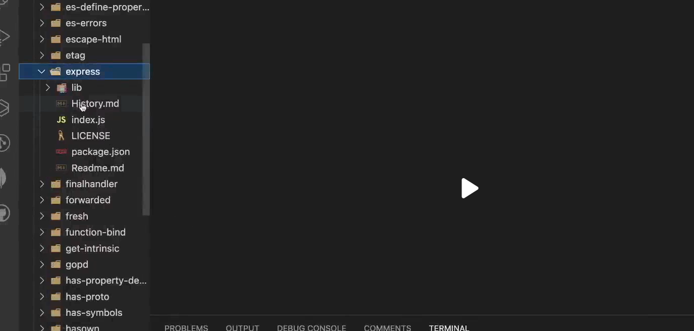
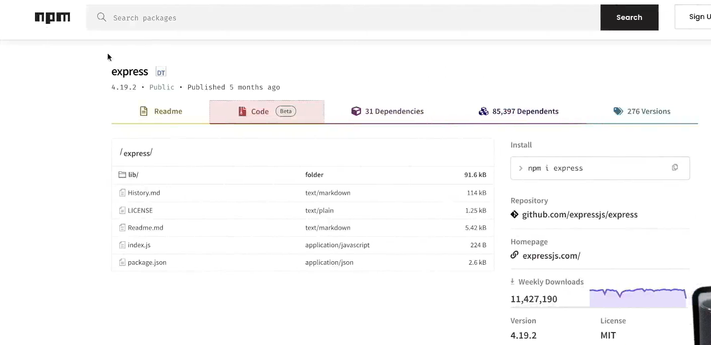
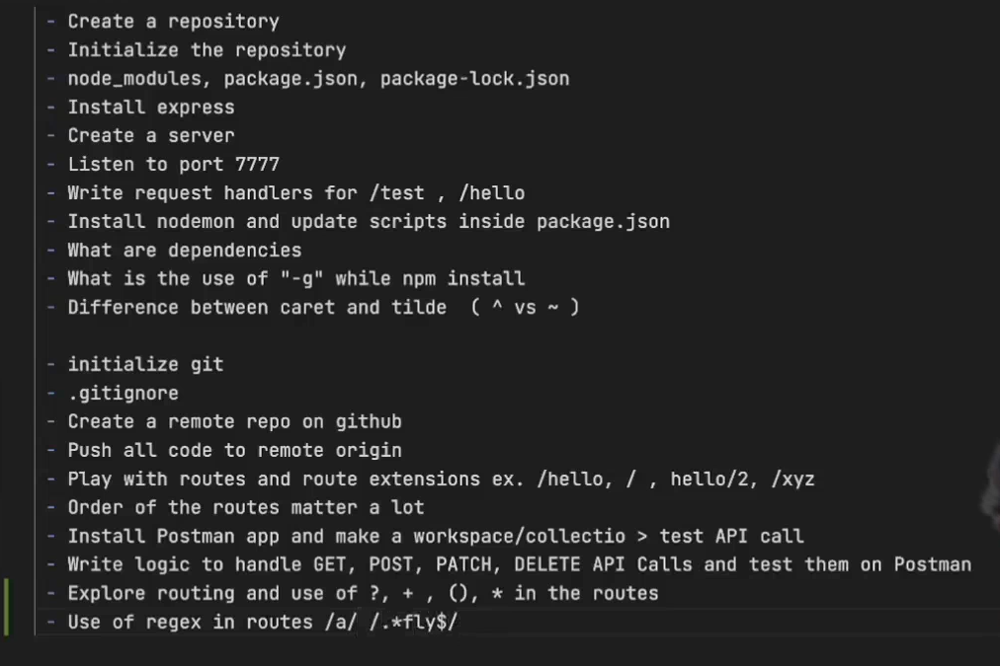

- Create a repository
- Initialize the repository
- node_modules, package.json, package-lock.json
- Install Express
- Create a server
- Listen to port 7777
- Write request handlers for /test, /hello
- install nodemon and update scripts inside package.json
- difference b/w caret(^) and tilde(~) 
- What are dependecies?

Routing and request handlers
- when you use app.use() it will match all the HTTP menthod API calls to /test

playing with the routes

when you use app.use() it will match all the HTTP menthod API calls to /test
app.use('/test', (req, res) => {
    res.send("Hello Rishav")
})

app.use('/hello', (req,res)=> {
    res.send("hello")
})

app.use('/', (req,res)=> {
    res.send("Abra ka dabra")
})

app.use('/user', (req,res, next)=> {
    res.send("Hello there")
})

app.get("/user", (req, res)=> {
    res.send("User page hit")
})

app.post("/user", (req, res)=> {
    res.send("User page hit")
})

to read query params

app.get("/users", (req,res)=> {
    console.log(req.query);
    
    res.send("Query page hit")
})

dynamic route param

app.get("/users/:id/:name/:password", (req,res)=> {
    console.log(req.params.id);
    
    res.send("Query page hit")
})

on adding ? mark here, it means b can appear 0 or 1 time 
app.get("/abc", (req,res)=> {
    res.send("ab?c")
})

app.get(/.*fly$/, (req, res) => {
    res.send({ firstName: "Akshay", lastName: "Saini" });
});

 This is a regular-expression route.

 What does /.*fly$/ mean?
 .* → any number of any characters
 fly → must contain fly at the end
 $ → end of the URL/path

 So it can match:

 /fly
 /butterfly
 /dragonfly
 /hello-fly
 /anythingfly

 But not:

 /fly/test
 /butterfly/abc
 /flight

 <!-- Middlewares -->

 if you don't return any thing from the route handler then it will go in to the infinite loop.
 ex -
 app.use("/users", (req, res)=> {

 })

 One route can have multiple route handler
